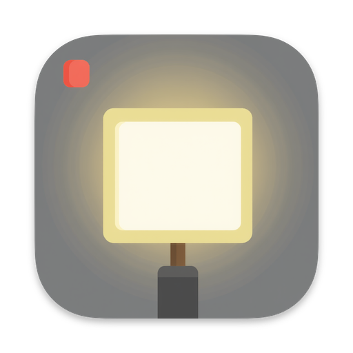
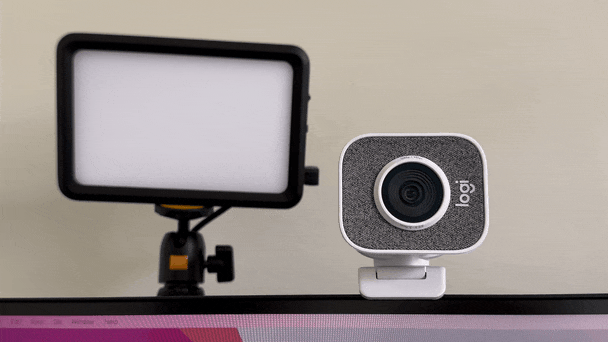
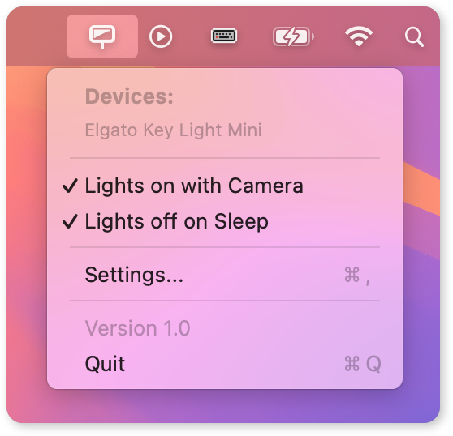

	
	<h1>Lolgato</h1>
	

		<b>Advanced controls for your Elgato lights</b>
	

	 

A macOS app that enhances control over Elgato lights, offering features beyond
the standard Elgato Control Center software.

## Features

- Automatically turn lights on and off based on camera activity
- Turn lights off when locking your Mac
- Global keyboard shortcuts:
  - Toggle lights on and off
  - Increase and decrease brightness of all lights
  - Increase and decrease temperature of all lights

## Download

[Latest release: `Lolgato.dmg`](https://github.com/raine/lolgato/releases/latest/download/Lolgato.dmg)

Requires macOS 14 or later.

## Screenshots

 

## How to Use

1. Install the app and launch it.
2. The app will appear in your menu bar.
3. Click the menu bar icon to access controls and settings.
4. Configure your preferences in the app settings.

The app will discover Elgato lights in your network automatically, the same way
as Elgato Control Center. If automatic discovery doesn't find your devices, you
can add them manually by IP address in the Devices tab of the settings window.

## FAQ

#### Can I use this with non-Elgato lights?

This app is designed specifically for Elgato lights such as the Elgato Key
Light.

#### Does this replace the Elgato Control Center?

No, this app complements the Elgato Control Center by providing additional
features. You may still need the official software for firmware updates and
certain settings.

#### How does the app detect if the camera is active?

The app uses macOS system APIs to detect camera activity across different
applications.

#### What if my devices aren't automatically discovered?

If automatic discovery doesn't find your Elgato lights, you can add them
manually by IP address. Go to Settings → Devices and click the "Add Device"
button to enter the IP address of your Elgato light.

## Feedback and Support

Please [open an issue](https://github.com/raine/Lolgato/issues/new) on GitHub
for bug reports, feature requests, or general feedback.

## License

MIT

## Disclaimer

Lolgato is an independent project and is not affiliated, associated, authorized,
endorsed by, or in any way officially connected with Elgato or Corsair Gaming,
Inc. All product and company names are trademarks™ or registered® trademarks
of their respective holders. Use of them does not imply any affiliation with or
endorsement by them.
